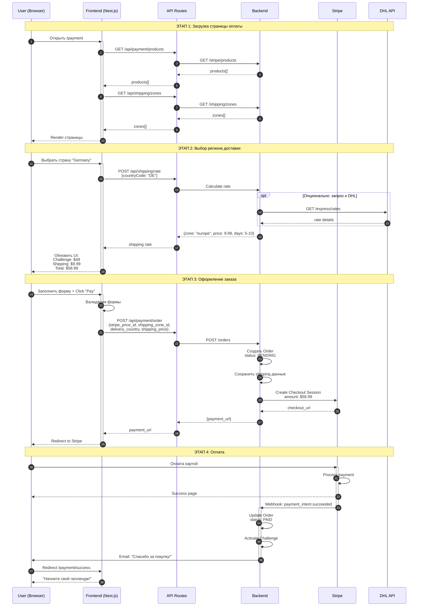
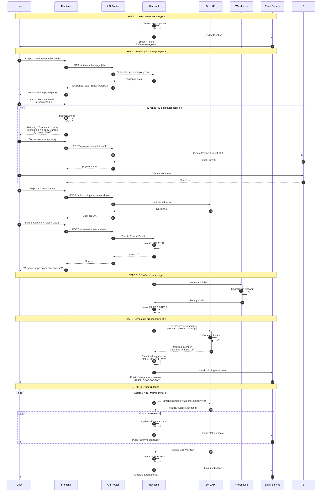
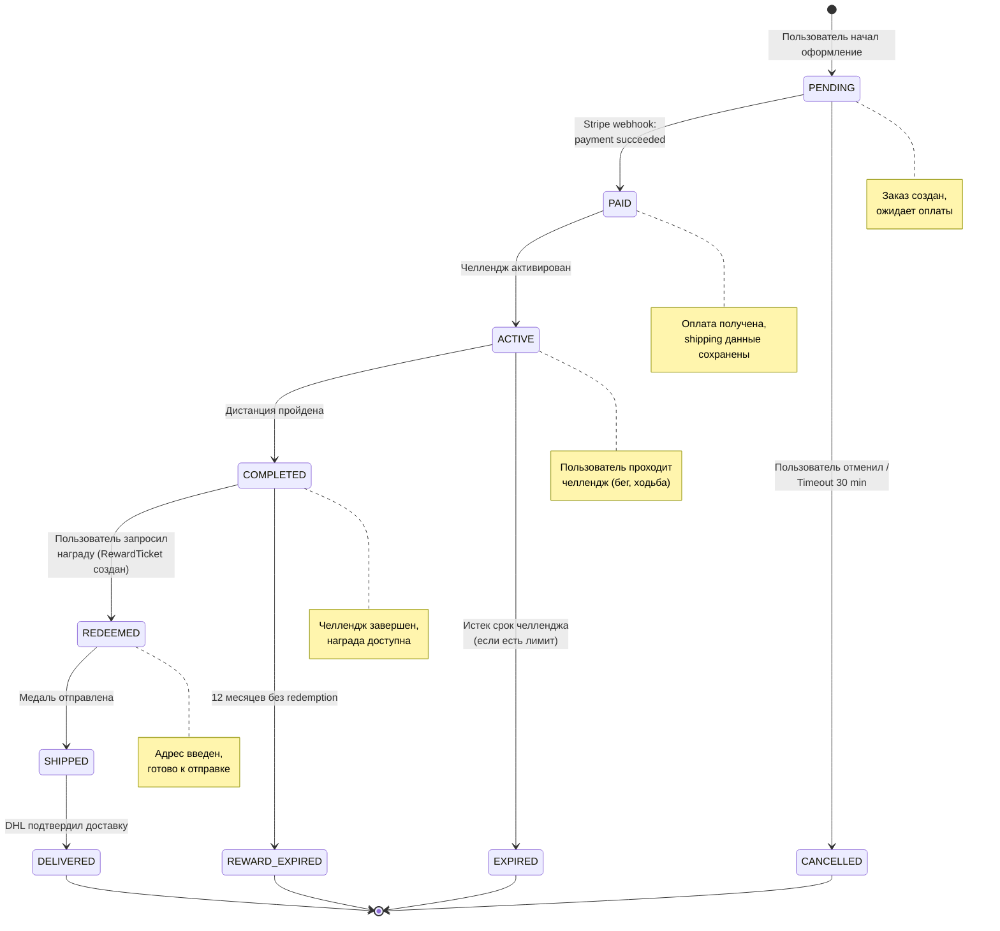
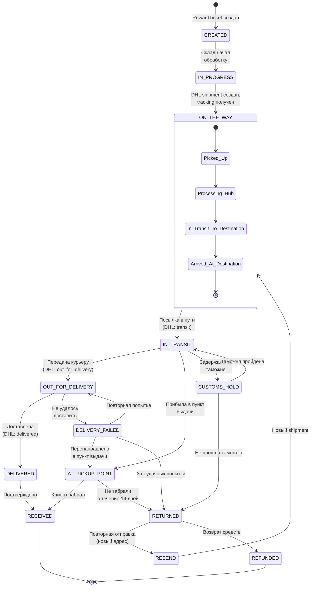
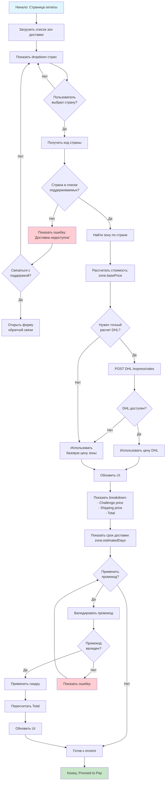
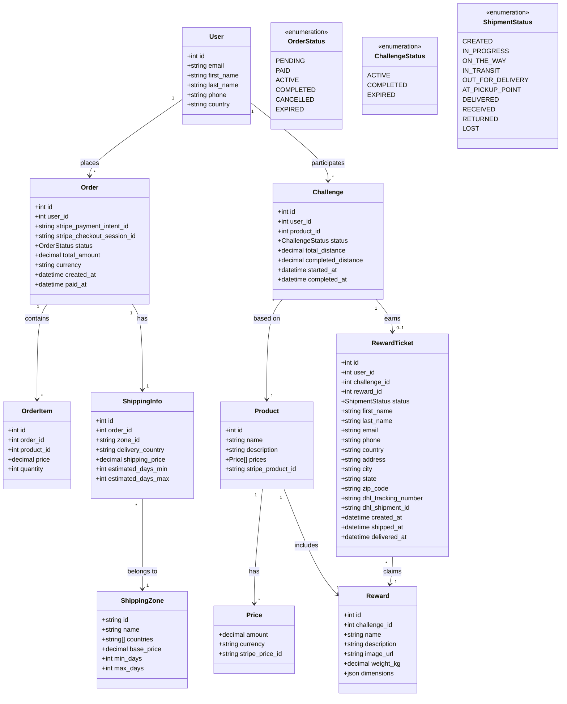
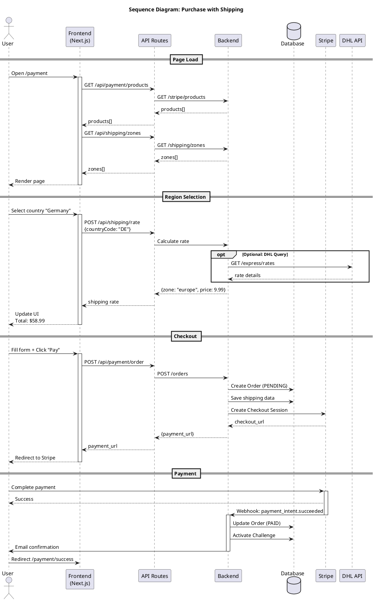

# UML Диаграммы: Интеграция доставки DHL

## Содержание
1. [Sequence Diagram: Полный процесс покупки](#1-sequence-diagram-полный-процесс-покупки)
2. [Sequence Diagram: Redemption и отправка](#2-sequence-diagram-redemption-и-отправка)
3. [State Diagram: Жизненный цикл заказа](#3-state-diagram-жизненный-цикл-заказа)
4. [State Diagram: Статусы доставки](#4-state-diagram-статусы-доставки)
5. [Activity Diagram: Выбор региона и расчет цены](#5-activity-diagram-выбор-региона-и-расчет-цены)
6. [Activity Diagram: Полный E2E процесс](#6-activity-diagram-полный-e2e-процесс)
7. [Class Diagram: Модели данных](#7-class-diagram-модели-данных)

---

## 1. Sequence Diagram: Полный процесс покупки

---

## 2. Sequence Diagram: Redemption и отправка

---

## 3. State Diagram: Жизненный цикл заказа

---

## 4. State Diagram: Статусы доставки (Shipment)

---

## 5. Activity Diagram: Выбор региона и расчет цены

---

## 6. Activity Diagram: Полный E2E процесс

```mermaid
flowchart TD
    subgraph PURCHASE["ЭТАП 1: ПОКУПКА"]
        A[Пользователь на лендинге] --> B[Выбор челленджа]
        B --> C[Выбор страны доставки]
        C --> D[Расчет стоимости]
        D --> E[Заполнение формы]
        E --> F[Оплата Stripe]
        F --> G{Оплата<br/>успешна?}
        G -->|Нет| H[Показать ошибку]
        H --> F
        G -->|Да| I[Order: PAID]
    end

    subgraph CHALLENGE["ЭТАП 2: ЧЕЛЛЕНДЖ"]
        I --> J[Подключение Strava/Fitbit]
        J --> K[Прохождение челленджа]
        K --> L{Дистанция<br/>пройдена?}
        L -->|Нет| K
        L -->|Да| M[Challenge: COMPLETED]
    end

    subgraph REDEMPTION["ЭТАП 3: ПОЛУЧЕНИЕ НАГРАДЫ"]
        M --> N[Уведомление пользователю]
        N --> O[Открыть /redeem]
        O --> P[Step 1: Personal Details]
        P --> Q{Страна в<br/>оплаченной зоне?}
        Q -->|Нет| R[Предложить доплату]
        R --> S{Согласен?}
        S -->|Нет| T[Изменить страну]
        T --> Q
        S -->|Да| U[Доплата через Stripe]
        U --> V[Step 2: Address]
        Q -->|Да| V
        V --> W[Валидация адреса]
        W --> X{Адрес<br/>валиден?}
        X -->|Нет| Y[Показать ошибки]
        Y --> V
        X -->|Да| Z[Step 3: Confirmation]
        Z --> AA[Claim Medal]
        AA --> AB[RewardTicket: CREATED]
    end

    subgraph SHIPPING["ЭТАП 4: ДОСТАВКА"]
        AB --> AC[Обработка на складе]
        AC --> AD[Упаковка медали]
        AD --> AE[Создание DHL shipment]
        AE --> AF[Получение tracking]
        AF --> AG[Email с tracking]
        AG --> AH[Shipment: ON_THE_WAY]
        AH --> AI{Статус<br/>обновился?}
        AI -->|Да| AJ[Push уведомление]
        AJ --> AI
        AI -->|Delivered| AK[Shipment: DELIVERED]
        AK --> AL[Email: Медаль доставлена!]
        AL --> AM[Конец]
    end

    style A fill:#e3f2fd
    style AM fill:#c8e6c9
    style H fill:#ffcdd2
    style Y fill:#ffcdd2
```

---

## 7. Class Diagram: Модели данных

---

## Визуализация диаграмм

### Онлайн инструменты:
1. **Mermaid Live Editor**: https://mermaid.live
2. **GitHub**: Автоматически рендерит Mermaid в .md файлах
3. **VS Code**: Расширение "Markdown Preview Mermaid Support"

### Как использовать:
1. Скопируйте код между тройными бэктиками (\`\`\`mermaid ... \`\`\`)
2. Вставьте в один из инструментов выше
3. Получите визуальную диаграмму

---

## Экспорт в другие форматы

### PlantUML версия (для сложных диаграмм):

---

*Документ создан: 2026-01-27*
*Версия: 1.0*
